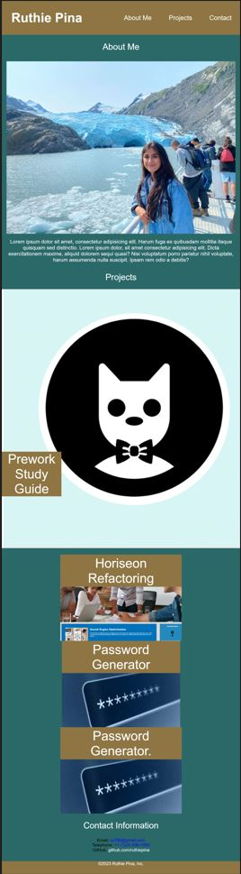

# Professional-Portfolio

## Description

A portfolio page that I can add to throughout the course duration.

## Table of Contents

-  [About the Project](#about-the-project)
-  [User Story](#user-story)
-  [Acceptance Criteria](#acceptance-criteria)
-  [Problems Solved](#probems-solved)
-  [Access](#access)
-  [Credits](#credits)
-  [License](#license)

## About The Project

The motivation for this project was to be able to practice and implement what the Module 02: Advanced CSS taught me. I
built from original code to showcase my skills using flexbox, media queries, and CSS variables. This deployed web app
will set me up for future success in career search.

## User Story

-  AS AN employer
-  I WANT to view a potential employee's deployed portfolio of work samples
-  SO THAT I can review samples of their work and assess whether they're a good candidate for an open position

## Acceptance Criteria

-  GIVEN I need to sample a potential employee's previous work
-  WHEN I load their portfolio
-  THEN I am presented with the developer's name, a recent photo or avatar, and links to sections about them, their
   work, and how to contact them
-  WHEN I click one of the links in the navigation
-  THEN the UI scrolls to the corresponding section
-  WHEN I click on the link to the section about their work
-  THEN the UI scrolls to a section with titled images of the developer's applications
-  WHEN I am presented with the developer's first application
-  THEN that application's image should be larger in size than the others
-  WHEN I click on the images of the applications
-  THEN I am taken to that deployed application
-  WHEN I resize the page or view the site on various screens and devices
-  THEN I am presented with a responsive layout that adapts to my viewport

## Problems Solved

-  Implementing media queries in my style sheet allowed my page to look pretty and stay responsive with various screen
   sizes. A big part of this work flow was making sure to discard any redundant code between my general styling and my
   media query styling.

-  Began with mobile-first design, then added styling and structure for bigger screen design.

-  Began my work and structuring my html file in nonsemantic, had to go back and format to semantic html.

-  making my avatar meet accessibility standards by adding alt attributes.

-  properly commented and consolidated css style selectors and properties.

## Access

The following link is the GitHub live URL of this project:

[Profesional Portfolio](https://ruthiepina.github.io/Professional-Portfolio/).

Screenshot of the final project:

## Credits

Following sources are where I searched for syntax information, different css style elements, troubleshooting code etc.

-  https://github.com/orgs/community/discussions/35195
-  https://css-tricks.com/a-complete-guide-to-css-media-queries/
-  https://developer.mozilla.org/en-US/docs/Web/CSS/CSS_media_queries/Using_media_queries
-  https://www.w3schools.com/css/css3_mediaqueries.asp
-  https://developer.mozilla.org/en-US/docs/Web/CSS/Using_CSS_custom_properties
-  https://developer.mozilla.org/en-US/docs/Web/CSS/CSS_flexible_box_layout/Basic_concepts_of_flexbox
-  https://www.w3schools.com/css/css3_flexbox_container.asp
-  https://css-tricks.com/snippets/css/a-guide-to-flexbox/#aa-display
-  https://www.w3schools.com/css/css3_variables.asp
-  https://coding-boot-camp.github.io/full-stack/github/professional-readme-guide\

## License

MIT License

---
